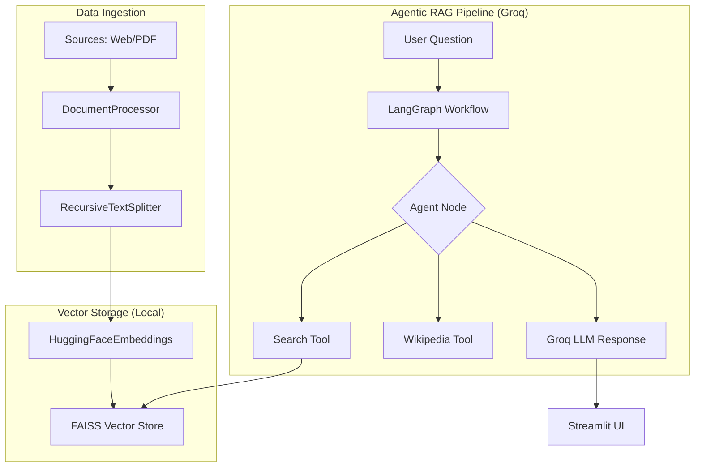

# DOCRAGSearch - Migration Documentation

This document outlines the architectural and code-level changes made to transition the "DOCRAGSearch" project from a proprietary OpenAI-based stack to a high-performance, open-source-friendly stack using Groq and HuggingFace.

## 🚀 Transition Overview

We shifted from a paid, API-dependent model (OpenAI) to a hybrid model that uses **Groq** for lightning-fast inference and local **HuggingFace** models for free document embeddings.

| Component | Old Solution (OpenAI) | New Solution (Open-Source/Groq) |
|-----------|-----------------------|---------------------------------|
| **LLM** | OpenAI GPT Models | Groq (Llama 3.1 8B Instant) |
| **Embeddings** | OpenAI text-embedding-3-small | HuggingFace (all-MiniLM-L6-v2) |
| **Orchestration** | LangChain / LangGraph | LangGraph (Optimized for Groq) |
| **Environment** | Python 3.x | Optimized for Python 3.13 |

---

## 🏗️ System Architecture

### Information Flow



---

## 🛠️ Key Changes & Bug Fixes

### 1. Library Modernization (LangChain Core)
**Issue**: Using deprecated `langchain.schema` caused `ModuleNotFoundError`.
**Fix**: Updated all imports to the modern `langchain_core` package.
- `Document` moved to `langchain_core.documents`.
- `HumanMessage` moved to `langchain_core.messages`.

### 2. Python 3.13 UUID Namespace Fix
**Issue**: `NameError: name 'uuid' is not defined` during type evaluation in Python 3.13.
**Fix**: Implemented a global monkeypatch in entry points (`main.py` and `streamlit_app.py`):
```python
import uuid
import builtins
builtins.uuid = uuid
```

### 3. Switch to HuggingFace Embeddings
**Issue**: Dependency on `OPENAI_API_KEY` for vectorization.
**Fix**: Replaced `OpenAIEmbeddings` with `HuggingFaceEmbeddings` in `vectorstore.py`. This runs locally and is completely free.
```python
from langchain_huggingface import HuggingFaceEmbeddings
self.embedding = HuggingFaceEmbeddings(model_name="all-MiniLM-L6-v2")
```

### 4. Groq Tool-Calling Optimization
**Issue**: Groq failed to validate tool schemas when provided via basic function pointers.
**Fix**: Refactored `reactnode.py` to use the `@tool` decorator with explicit Pydantic `args_schema`. This ensures the model correctly interprets parameter names like `query`.

### 5. Dependency Cleanup
We added several critical packages to `requirements.txt`:
- `langchain-huggingface` & `sentence-transformers` (for embeddings).
- `pypdf` (for PDF processing).
- `langchain-groq` (for LLM inference).

---

## 🏃 How to Run the Latest Code

1. **Configure Environment**: Update `.env` with your Groq key.
   ```env
   GROQ_API_KEY=gsk_your_key_here
   ```
2. **Install Dependencies**:
   ```bash
   pip install -r requirements.txt
   ```
3. **Launch Application**:
   ```bash
   streamlit run streamlit_app.py
   ```

---
*Documentation generated after successful migration on 2026-03-01.*
